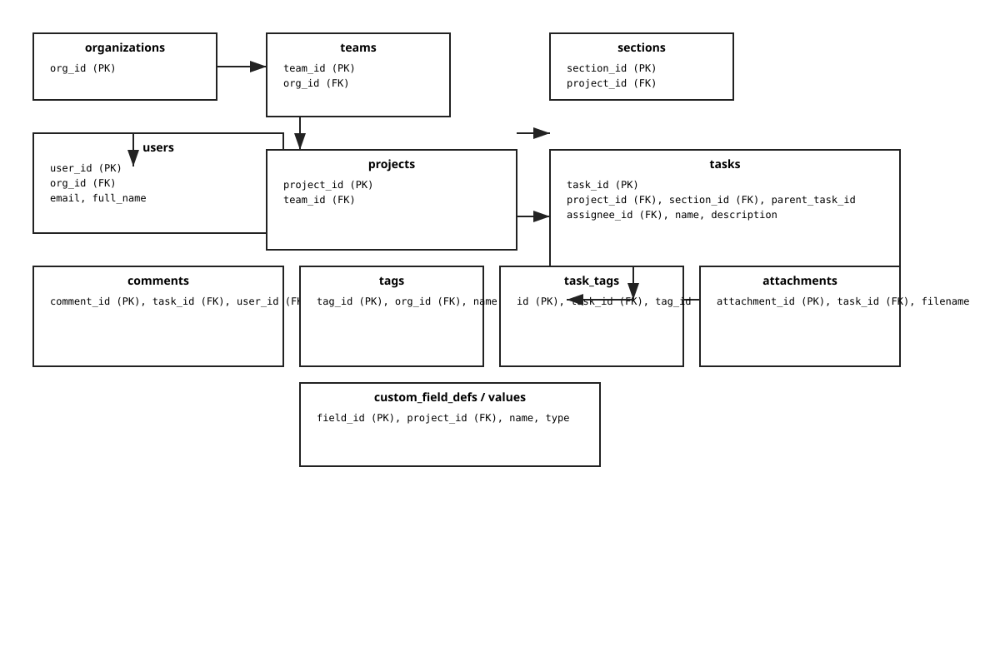

# Asana Simulation — Documentation

This document summarizes the relational schema, seed-data methodology, LLM prompt templates, data sources, and run instructions for the Asana seed-data project.

**A. Database Schema**
- Schema DDL: see `schema.sql` for full SQLite DDL.
- Primary tables (purpose and key columns):
  - `organizations`: `org_id` (PK), `name`, `domain`
  - `teams`: `team_id` (PK), `org_id` (FK)
  - `users`: `user_id` (PK), `org_id` (FK), `email`, `full_name`, `role`, `created_at`
  - `team_memberships`: `membership_id` (PK), `team_id` (FK), `user_id` (FK)
  - `projects`: `project_id` (PK), `team_id` (FK), `name`, `description`, `created_at`
  - `sections`: `section_id` (PK), `project_id` (FK), `name`
  - `tasks`: `task_id` (PK), `project_id` (FK), `section_id` (FK), `parent_task_id` (self-FK), `name`, `description`, `assignee_id` (FK), `due_date`, `created_at`, `completed`, `completed_at`
  - `comments`: `comment_id` (PK), `task_id` (FK), `user_id` (FK), `body`, `created_at`
  - `custom_field_defs`: `field_id` (PK), `project_id` (FK), `name`, `field_type`
  - `custom_field_values`: `value_id` (PK), `field_id` (FK), `task_id` (FK), `value`
  - `tags`: `tag_id` (PK), `org_id` (FK), `name`
  - `task_tags`: `id` (PK), `task_id` (FK), `tag_id` (FK)
  - `attachments`: `attachment_id` (PK), `task_id` (FK), `filename`, `url`, `uploaded_by` (FK), `created_at`

Entity-Relationship diagram:  export the DDL or paste tables to a diagram tool (dbdiagram.io or draw.io). Key relationships:



Key relationships (summary):

Design notes
- Custom fields: defined per-project in `custom_field_defs` with values in `custom_field_values` to support arbitrary field sets and types (text/number/enum). This avoids sparse wide tables.
- Task hierarchy: `parent_task_id` supports subtasks referencing another `tasks.task_id`. Subtasks live in `tasks` to reuse fields/relations.

**B. Seed Data Methodology (column-by-column highlights)**
This section documents generation strategies implemented in `src/generators/`.

- Table: `users`
  - `user_id` (UUIDv4): deterministic unique IDs from `uuid.uuid4()`
  - `full_name`, `email`: generated via `faker` (census-like name distributions); emails are unique
  - `role`: job title from `faker.job()` to mimic varied seniority
  - `created_at`: uniform sample over a 6–12 month history with weekday bias

- Table: `teams`
  - team counts derive from `num_users / ~10` (average team size ≈10). Names use business-phrase samples to mimic real team names.

- Table: `projects`
  - 1–3 projects per team (randomized). Names follow product/initiative-like phrases.

- Table: `sections`
  - Standard section set per project: `To Do`, `In Progress`, `Review`, `Done`.

- Table: `tasks`
  - `task_id`: UUIDv4
  - `name`: generated using the LLM stub in `src/generators/llm_stub.py` (patterned templates). For production use, swap with an LLM call using the provided prompt templates.
  - `description`: varied lengths (20% empty, 50% short, 30% long with acceptance criteria) produced by LLM stub; generated using temperature-like randomness to ensure variety
  - `assignee_id`: assigned with ~85% probability from the project's team membership; remaining left unassigned to reflect real-world gaps
  - `created_at`: sampled over 0–720 days (configurable) with higher activity weekdays
  - `due_date`: set for ~90% of tasks, skewed toward near-term for sprint-like projects (1–90 days after creation) and avoiding weekends in most cases
  - `completed` / `completed_at`: completion probability varies (default ~60%); `completed_at` is always after `created_at` and before now
  - Relational consistency enforced: tasks belong to the project and its sections; assignees are members of the task's team

- Table: `comments`
  - Generated for ~40% of tasks, authored by assignees or other team members; timestamps follow creation order

- Table: `tags` / `task_tags`
  - A small set of org-level tags (bug, feature, urgent, etc.) assigned to ~35% of tasks

- Table: `custom_field_defs` / `custom_field_values`
  - 0–3 custom fields per project; types: text, number, enum. Values assigned per-task when applicable

- Table: `attachments`
  - Files attached to ~10% of tasks; `url` is synthetic (placeholder)

Data sources & references
- Company names / projects: public directories (YC, Crunchbase) and product naming patterns
- User names / demographics: `faker` (based on census distributions) and public name lists
- Task/issue patterns: analyzed from public GitHub issues, Asana community templates, and product release notes to craft realistic naming patterns
- Benchmarks used: Asana “Anatomy of Work” reports and general industry sprint planning guidance for due-date distributions and completion rates

LLM generation guidance
- Prompts: stored in `prompts/llm_prompts.md`. Example task-name prompt:
  "Generate a realistic task name for a {project_type} project in a B2B SaaS product team. Keep it concise (3–7 words)."
- Parameters: when calling a real LLM, use temperature 0.7–1.0 for variety, include 4–8 few-shot examples per project type, and post-process to avoid PII leakage.
- Variety: sample different prompt templates and mix in heuristic patterns (component-action-detail) to avoid uniform outputs.

Temporal & relational consistency rules
- `created_at` <= `completed_at` <= now
- `due_date` >= `created_at` when present (overdue tasks are allowed when due_date < now and completed=0)
- Tasks' `assignee_id`, if present, must be a user who is a member of the task's team (enforced at generation time)

How to run (local)
1. Install dependencies:

```bash
F:/2022BCD0028/final/.venv/Scripts/python.exe -m pip install -r requirements.txt
```

2. Generate a database (example 200 users):

```bash
F:/2022BCD0028/final/.venv/Scripts/python.exe src/main.py --users 200
```

3. Run the Streamlit read-only explorer:

```bash
F:/2022BCD0028/final/.venv/Scripts/python.exe -m streamlit run src/streamlit_app.py --server.port 8502
```

Notes: the Streamlit app is explicitly read-only and does not modify the database or trigger generation. Use `src/main.py` to re-run generation.

Deliverables in this repo
- `schema.sql` — full DDL
- `src/` — generators and `main.py`
- `prompts/llm_prompts.md` — prompt templates
- `docs/Documentation.md` — this file
- `output/asana_simulation.sqlite` — generated DB (not checked into repo by default)

Next steps / optional enhancements
- Replace `llm_stub` with real LLM calls (implement API wrapper in `src/utils/` with rate-limiting and prompt templates), ensuring prompt auditing and data privacy
- Add simulated event logs (activity feed) and more complex workflow patterns (dependencies, milestones)
- Create an ER diagram image exported from dbdiagram.io and include in `docs/`

If you want, I can convert this markdown into a Google Doc, include the ER diagram export, or add a short README section ready for submission. 
